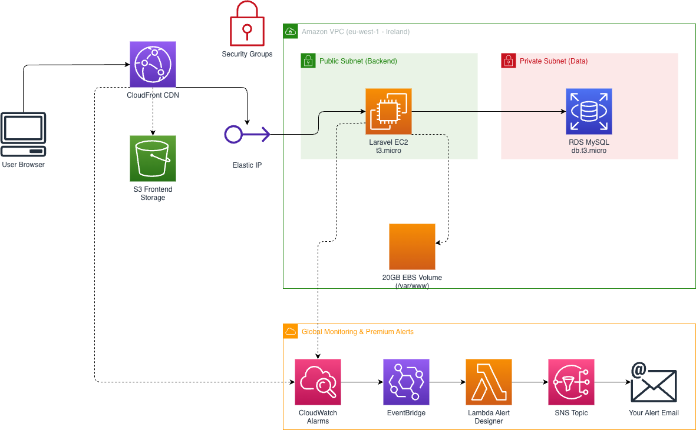

# We-Print Infrastructure (AWS + Pulumi)

This repository contains the **Infrastructure as Code (IaC)** for the We-Print platform, built using Pulumi and Python. It manages a highly-available, secure, and monitored environment across multiple environments (`dev` and `prod`).

## 🏗️ Architecture Overview



The system follows a modern full-stack architecture optimized for AWS Free Tier eligibility:

- **Frontend**: Angular SPA hosted on **S3** and delivered via **CloudFront** (CDN) with OAC security.
- **Backend**: Laravel API running on **EC2 (t3.micro)** with PHP 8.2 & Nginx.
- **Database**: **RDS MySQL (db.t3.micro)** in private subnets for high security.
- **Storage**: Persistent **EBS Volume (20GB)** mounted at `/var/www` to ensure data and codebase survive instance termination.
- **Networking**: Custom **VPC** with distinct public and private subnets, NAT-less for cost optimization.

## ✨ Key Features

### 1. Multi-Environment Isolation
- **Stacks**: Separate `dev` and `prod` stacks.
- **Naming**: All resources are automatically prefixed with the stack name (e.g., `weprint-vpc-dev`).
- **Isolation**: Workloads are completely independent between environments.

### 2. Premium Monitoring & Alerting
- **Host Metrics**: CloudWatch Agent installed on EC2 for Memory and Disk usage monitoring.
- **Threshold Alarms**: Automatic alerts for CPU > 80%, RAM > 80%, and Disk > 80%.
- **Uptime Monitoring**: Non-intrusive monitoring using CloudFront 5xx Error Rates (monitored via `us-east-1` for global insights).
- **Designer Emails**: Custom **AWS Lambda formatters** turn technical JSON alerts into beautiful, human-readable status reports in your inbox.

### 3. Persistent Backend Setup
- **Disk Management**: The entire application directory (`/var/www`) is hosted on a dedicated EBS volume.
- **Reliability**: If the EC2 instance is replaced, the codebase, `.env` files, and order files remain safe on the volume.

### 4. CI/CD Ready
- **GitHub Actions**: Integrated with automated workflows for both Frontend and Backend deployments.
- **Zero-Touch Config**: Secrets managed via AWS Secrets Manager and GitHub Secrets.

## 🚀 Getting Started

### Prerequisites
- [Pulumi CLI](https://www.pulumi.com/docs/get-started/install/)
- [AWS CLI](https://aws.amazon.com/cli/)
- Python 3.9+

### Initial Setup
1. **Clone the repository**:
   ```bash
   git clone <repo-url>
   cd weprint-infra/Serverless-Infra
   ```

2. **Install dependencies**:
   ```bash
   pip install -r requirements.txt
   ```

3. **Select a stack**:
   ```bash
   pulumi stack select dev
   ```

4. **Deploy**:
   ```bash
   pulumi up
   ```

## 🛠️ Configuration

Configuration is managed via `Pulumi.<stack>.yaml`:

```yaml
config:
  weprint-infra:alert_email: your-email@example.com
  weprint-infra:instance_type: t3.micro
  weprint-infra:db_instance_class: db.t3.micro
```

## 📊 Monitoring Dashboard

To view your infrastructure health:
1. Log in to **AWS Console**.
2. Navigate to **CloudWatch > Alarms**.
3. All alarms starting with `weprint-` provide a real-time status of your system.

---
**Maintained by We-Print DevOps** 🚀